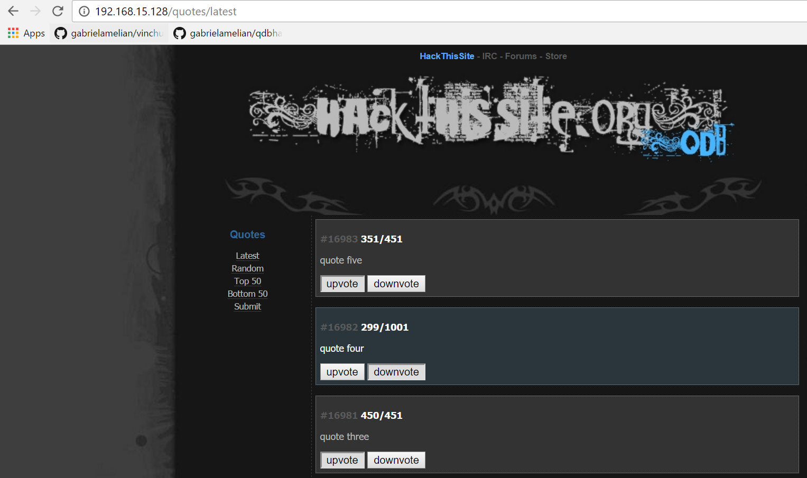

Quote database for "Hack This Site"
===================================



Install dependencies
====================

```
composer install
```

Configure database
==================

Copy `config.php.orig` into `config.php` and fill in the details. schema.sql contains a base schema for the DB with some test data.

Deploying on Apache
===================

* Deploy these files on /var/www/html. 
* Ensure AllowOverride and mod_rewrite are enabled.
* Modify apache configuration so that it serves /var/www/html/web/. This
can be done for example on the /etc/apache2/sites-enabled/000-default.conf:

```
<VirtualHost *:80>
	ServerAdmin webmaster@localhost
	DocumentRoot /var/www/html/web
	ErrorLog ${APACHE_LOG_DIR}/error.log
	CustomLog ${APACHE_LOG_DIR}/access.log combined
</VirtualHost>
```

* Restart apache.

Testing
=======

```
phpunit tests/
```
